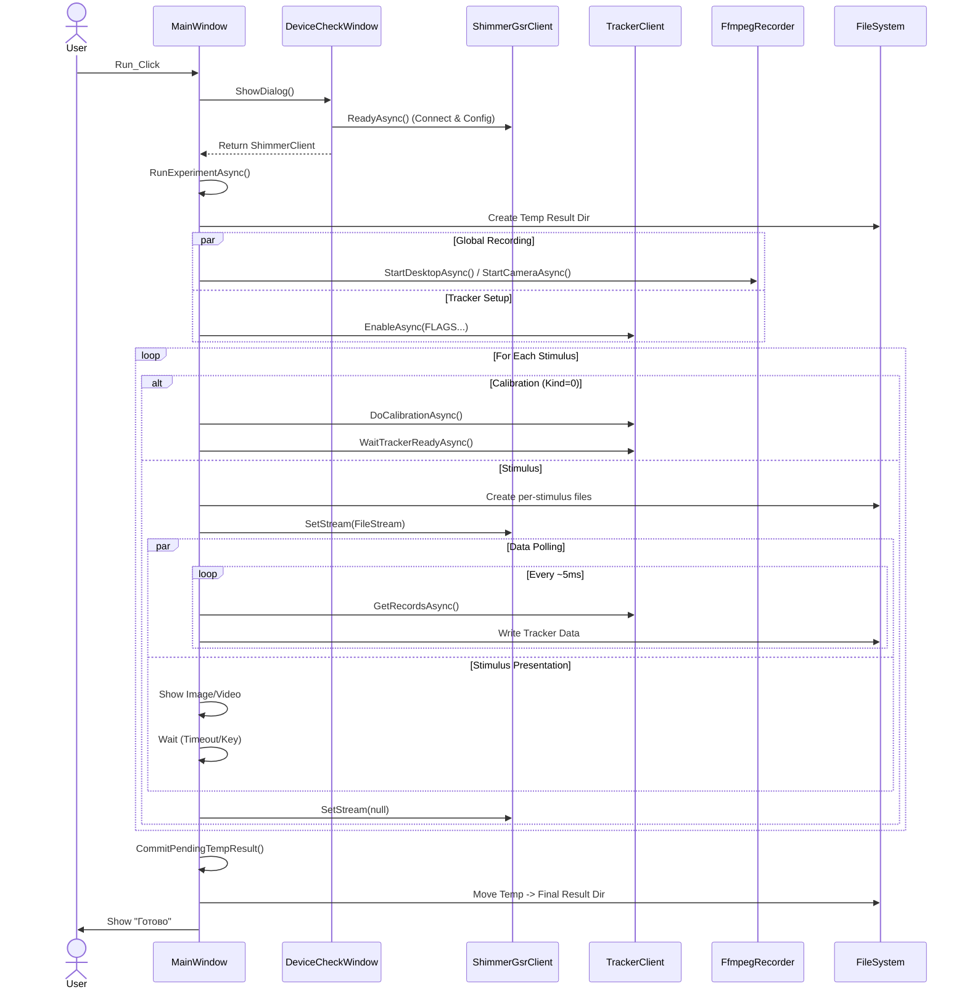
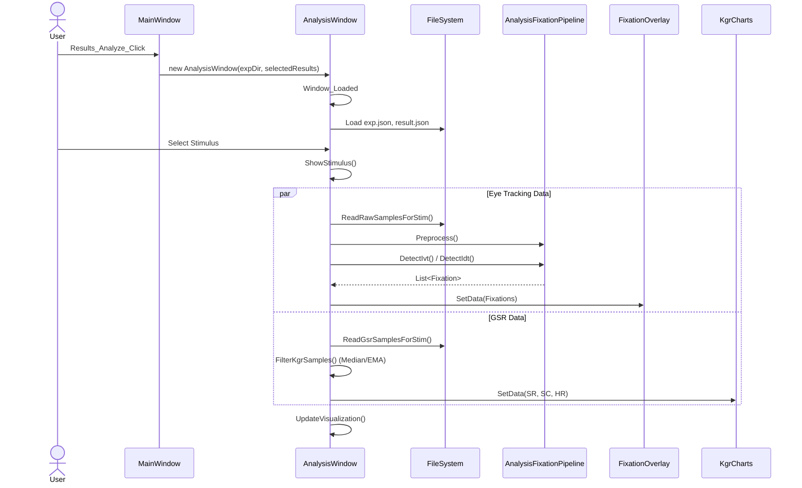

# Архитектура NeuroBureau.Experiment

Документ описывает архитектуру приложения `NeuroBureau.Experiment`, предназначенного для проведения нейрофизиологических экспериментов (айтрекинг, КГР, запись видео) и последующего анализа данных.

## Обзор системы

Приложение построено на платформе .NET 9.0 (WPF) и реализует полный цикл проведения эксперимента:
1.  **Настройка:** Создание и редактирование экспериментов, выбор оборудования.
2.  **Сбор данных:** Синхронная запись данных с айтрекера, датчиков КГР (Shimmer), клавиатуры/мыши, а также запись экрана и веб-камеры.
3.  **Анализ:** Визуализация траекторий взгляда (Gaze Plot), тепловых карт (Heatmap), Bee Swarm и графиков физиологических показателей.
4.  **Экспорт:** Выгрузка сырых данных и обработанных метрик.

## Основные подсистемы и поток данных

Архитектура приложения разделена на слои: работа с оборудованием, логика эксперимента, хранение данных и анализ.

```mermaid
graph TD
    subgraph Hardware [Оборудование]
        ET[Eye Tracker]
        GSR[Shimmer GSR]
        Cam[Web Camera]
        Input[Mouse/Keyboard]
    end

    subgraph Acquisition [Сбор данных]
        TC[TrackerClient]
        SC[ShimmerGsrClient]
        FR[FfmpegRecorder]
        MK[Input Hooks]
    end

    subgraph Core [Ядро приложения]
        MW[MainWindow]
        EL[ExperimentLoader]
        MS[MonitorService]
    end

    subgraph Storage [Файловая система]
        ExpJson[exp.json]
        ResJson[result.json]
        RawDat[tracker.dat / gsr.bin]
        Media[Stimuli / Recordings]
    end

    subgraph Analysis [Анализ и Визуализация]
        AW[AnalysisWindow]
        AFP[AnalysisFixationPipeline]
        Overlays[Overlays (Fixation, Heatmap)]
        Charts[MetricCharts]
    end

    ET -->|HTTP/TCP| TC
    GSR -->|Bluetooth/Serial| SC
    Cam -->|FFmpeg| FR
    Input --> MK

    TC --> MW
    SC --> MW
    MK --> MW

    MW -->|Write| Storage
    EL -->|Read| Storage

    Storage -->|Read| AW
    AW --> AFP
    AFP --> Overlays
    AW --> Charts
```

### Ключевые компоненты

*   **`MainWindow`**: Центральный узел управления экспериментом. Отвечает за инициализацию устройств, цикл показа стимулов и координацию записи потоков данных.
*   **`TrackerClient`**: Клиент для взаимодействия с айтрекером (через HTTP API). Получает координаты взора, диаметр зрачка и 3D-позицию.
*   **`ShimmerGsrClient`**: Клиент для работы с GSR-сенсорами Shimmer. Читает данные о кожной проводимости (GSR) и пульсе (PPG).
*   **`FfmpegRecorder`**: Обертка над FFmpeg для записи видео с экрана и камеры.
*   **`AnalysisWindow`**: Окно пост-анализа. Загружает записанные данные, выполняет детекцию фиксаций и визуализирует результаты.
*   **`AnalysisFixationPipeline`**: Конвейер обработки сырых данных взора. Включает препроцессинг и алгоритмы детекции фиксаций (I-VT, I-DT).

---

## Сценарий 1: Запуск эксперимента

Процесс запуска эксперимента включает проверку оборудования, калибровку и цикл показа стимулов с синхронной записью данных.



---

## Сценарий 2: Анализ результатов

Анализ включает загрузку сырых данных, их фильтрацию, выделение фиксаций и отображение на графиках и оверлеях.



## Структура данных

### Файловая система
Данные эксперимента организованы следующим образом:
*   `exp.json`: Описание эксперимента (список стимулов, настройки устройств).
*   `results/<result_uid>/`: Папка конкретного прохождения.
    *   `result.json`: Метаданные результата (дата, участник, разрешение экрана).
    *   `tracker.dat`: Глобальный файл данных трекера (если используется).
    *   `desktop.mkv` / `camera.mkv`: Глобальные видеозаписи.
    *   `<stimulus_uid>/`: Папка данных для конкретного стимула.
        *   `<tracker_uid>`: Бинарный файл сырых данных взора (формат `TrackerData`).
        *   `<shimmer_uid>`: Бинарный файл данных GSR (формат `GsrData`).
        *   `stimul.mkv`: Запись экрана во время стимула (для `SCREEN_RECORD`).

### Ключевые форматы данных

**TrackerData (Binary):**
Записи фиксированного размера (обычно 68 байт), содержащие:
*   Валидность (флаги)
*   Время (мс)
*   Координаты взора (X, Y) для левого/правого глаза
*   Диаметр зрачка
*   3D-координаты глаз

**GsrData (Binary):**
Записи, содержащие данные с Shimmer:
*   Время
*   Сопротивление (SR) / Проводимость (SC)
*   Пульс (HR)
*   Фотоплетизмограмма (PPG)

## Алгоритмы анализа

1.  **Детекция фиксаций (`AnalysisFixationPipeline`):**
    *   **I-VT (Velocity Threshold):** Классификация по скорости движения глаз. Если скорость ниже порога — это фиксация.
    *   **I-DT (Dispersion Threshold):** Классификация по дисперсии точек в окне времени.
2.  **Фильтрация КГР:**
    *   Медианный фильтр для удаления выбросов.
    *   Экспоненциальное скользящее среднее (EMA) для сглаживания.
