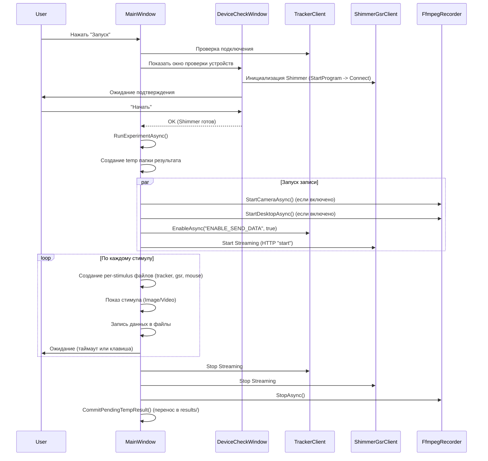
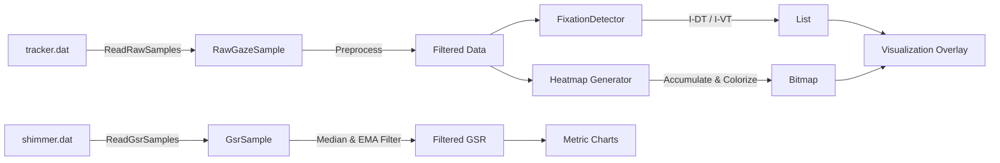

# Архитектура NeuroBureau.Experiment

## 1. Обзор

**NeuroBureau.Experiment** — это WPF-приложение для проведения нейрофизиологических экспериментов с использованием айтрекинга (eye-tracking) и регистрации кожно-гальванической реакции (КГР/GSR). Приложение позволяет демонстрировать стимулы (изображения, видео, запись экрана), записывать данные с сенсоров, проводить первичный анализ (тепловые карты, фиксации) и экспортировать данные.

### Ключевые возможности
*   **Проведение экспериментов**: Показ стимулов по сценарию (`exp.json`), синхронная запись данных айтрекера и КГР.
*   **Поддержка оборудования**:
    *   Айтрекеры (через HTTP API, совместимость с GazePoint/PathFinder).
    *   Shimmer GSR (через UDP/HTTP мост `Shimmer.exe`).
    *   Веб-камеры и запись экрана (через `ffmpeg`).
*   **Анализ данных**:
    *   Визуализация взора (Scanpath, Heatmap, Bee Swarm).
    *   Детекция фиксаций (алгоритмы I-DT, I-VT).
    *   Анализ КГР (фильтрация, графики SR/SC/HR/PPG).
    *   Выделение зон интереса (AOI).
*   **Экспорт**: Мультиформатный экспорт (CSV, XLSX, изображения, EDF) с гибкой настройкой.

---

## 2. Архитектура высокого уровня

Приложение построено на платформе .NET 9 (WPF) с использованием паттерна MVVM (частично).

```mermaid
graph TD
    User[Пользователь] --> MainWindow[MainWindow (WPF)]
    MainWindow --> MainVM[MainViewModel]
    
    subgraph "Recording Subsystem"
        MainVM --> MonitorService[MonitorService]
        MainWindow --> TrackerClient[TrackerClient]
        MainWindow --> ShimmerClient[ShimmerGsrClient]
        MainWindow --> FfmpegRecorder[FfmpegRecorder]
    end
    
    subgraph "Analysis Subsystem"
        MainWindow --> AnalysisWindow[AnalysisWindow]
        AnalysisWindow --> ExpLoader[ExperimentLoader]
        AnalysisWindow --> FixDetector[FixationDetector]
        AnalysisWindow --> Heatmap[HeatmapOverlay]
    end
    
    subgraph "Export Subsystem"
        MainWindow --> MultiExportWindow[MultiExportWindow]
        MultiExportWindow --> MultiExportService[MultiExportService]
    end
    
    subgraph "Data Storage"
        ExpFile[exp.json]
        ResFile[result.json]
        DatFiles[*.dat / *.bin]
    end
    
    Recording Subsystem --> DatFiles
    Analysis Subsystem --> ResFile
    Analysis Subsystem --> DatFiles
    Export Subsystem --> DatFiles
```

### Основные компоненты

| Компонент | Описание |
| :--- | :--- |
| **[`App.xaml.cs`](NeuroBureau.Experiment/App.xaml.cs)** | Точка входа. Обработка необработанных исключений, глобальное логирование. |
| **[`MainWindow.xaml.cs`](NeuroBureau.Experiment/MainWindow.xaml.cs)** | Главное окно. Управляет циклом эксперимента, отображением стимулов и координацией записи. |
| **[`MainViewModel.cs`](NeuroBureau.Experiment/MainViewModel.cs)** | ViewModel главного окна. Управляет списком экспериментов, статусом устройств и привязкой данных. |
| **[`AppConfigManager.cs`](NeuroBureau.Experiment/AppConfigManager.cs)** | Управление конфигурацией (`config.json`). |

---

## 3. Подсистема записи (Recording)

Отвечает за взаимодействие с оборудованием и сохранение данных во время эксперимента.

### Компоненты записи

*   **[`MonitorService`](NeuroBureau.Experiment/MonitorService.cs)**: Определяет физические параметры мониторов (размеры в мм/пкс) через WinAPI и WMI. Критично для корректного расчета угловых величин.
*   **[`TrackerClient`](NeuroBureau.Experiment/TrackerClient.cs)**: HTTP-клиент для айтрекера. Отправляет команды XML (`<SET ... />`) и получает поток данных.
*   **[`ShimmerGsrClient`](NeuroBureau.Experiment/ShimmerGsrClient.cs)**: Управляет внешним процессом `Shimmer.exe`. Получает данные КГР по UDP, парсит JSON-ответы управления по HTTP. Конвертирует сырые байты в формат для записи.
*   **[`FfmpegRecorder`](NeuroBureau.Experiment/FfmpegRecorder.cs)**: Обертка над `ffmpeg.exe`. Записывает видео с веб-камеры или захватывает экран (`gdigrab`).

### Сценарий запуска эксперимента



---

## 4. Подсистема анализа (Analysis)

Обеспечивает визуализацию и обработку записанных данных.

### Компоненты анализа

*   **[`AnalysisWindow`](NeuroBureau.Experiment/AnalysisWindow.xaml.cs)**: Окно анализа. Загружает данные, управляет плеером (VLC) и оверлеями.
*   **[`ExperimentLoader`](NeuroBureau.Experiment/ExperimentLoader.cs)**: Утилиты для импорта/экспорта архивов `.tar.gz` и поиска файлов эксперимента.
*   **[`FixationDetector`](NeuroBureau.Experiment/FixationDetector.cs)**: Реализует алгоритмы детекции фиксаций:
    *   **I-DT (Dispersion Threshold)**: Группировка точек по пространственной близости.
    *   **I-VT (Velocity Threshold)**: Группировка по скорости движения глаз.
*   **[`HeatmapOverlay`](NeuroBureau.Experiment/HeatmapOverlay.cs)**: Рендеринг тепловых карт. Использует буфер накопления "тепла" и цветовую палитру.
*   **[`AnalysisFixationPipeline`](NeuroBureau.Experiment/AnalysisFixationPipeline.cs)**: Конвейер обработки: сырые данные -> фильтрация -> детекция -> маппинг координат.

### Поток данных анализа



---

## 5. Подсистема экспорта (Export)

Позволяет выгружать данные в удобном для обработки виде.

### Компоненты экспорта

*   **[`MultiExportService`](NeuroBureau.Experiment/MultiExportService.cs)**: Основная логика экспорта.
*   **[`MultiExportViewModel`](NeuroBureau.Experiment/MultiExportViewModel.cs)**: Управление настройками экспорта (выбор стимулов, форматов).

### Режимы экспорта
1.  **SeparateFiles**: Отдельный файл для каждой пары (Результат, Стимул).
2.  **FilePerStimul**: Один файл на стимул (все результаты внутри).
3.  **FilePerResult**: Один файл на результат (все стимулы внутри).
4.  **AllInOne**: Все данные в одном файле (ограничено для некоторых типов данных).

### Поддерживаемые форматы
*   **Данные**: CSV, XLSX.
*   **Изображения**: PNG, JPG (Scanpath, Heatmap).
*   **Сырые данные**: Копирование исходных бинарных файлов.
*   **EDF**: Экспорт в формат EDF (если есть ЭЭГ данные).

---

## 6. Модели данных

### Файловая структура
```text
Experiments/
  └── {Experiment_UID}/
      ├── exp.json              # Описание эксперимента
      ├── stimuli/              # Папка со стимулами (опционально)
      └── results/
          └── {Result_UID}/
              ├── result.json   # Метаданные результата
              ├── desktop.mkv   # Запись экрана (весь опыт)
              ├── camera.mkv    # Запись камеры (весь опыт)
              └── {Stimulus_UID}/
                  ├── {Tracker_UID}  # Сырые данные трекера (bin)
                  ├── {Shimmer_UID}  # Сырые данные GSR (bin)
                  └── {Mouse_UID}    # Данные мыши/клавиатуры (bin)
```

### Основные классы ([`Models.cs`](NeuroBureau.Experiment/Models.cs))
*   **`ExperimentFile`**: Корневой объект конфигурации.
*   **`StimulFile`**: Настройки стимула (путь, таймаут, тип).
*   **`ResultFile`**: Метаданные прохождения (время, характеристики испытуемого).

### Форматы бинарных данных
*   **Tracker Data**: 4-байтовые float/int поля (время, координаты, валидность, зрачок). Размер записи: `TrackerData.Size`.
*   **GSR Data**: 8-байтовые double поля (время, HR, SR, SC, Range, PPG). Размер записи: 48 байт (wire) или 88 байт (legacy).
*   **Mouse/Keyboard**: 48 байт (время, код клавиши, координаты мыши).
